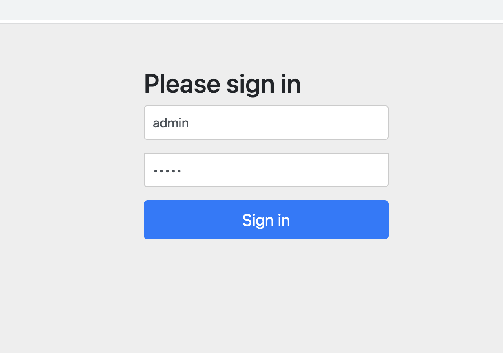
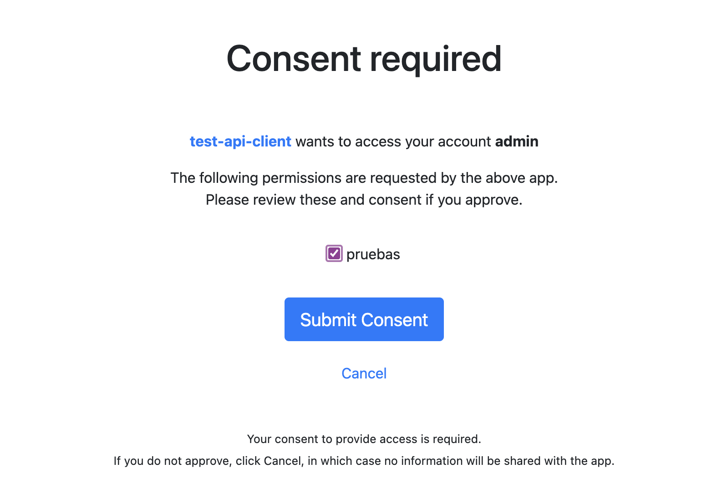
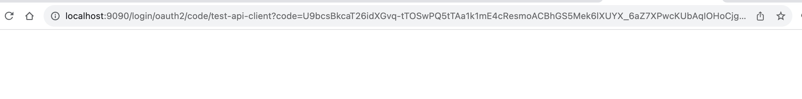
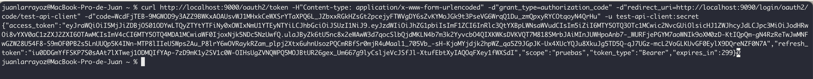
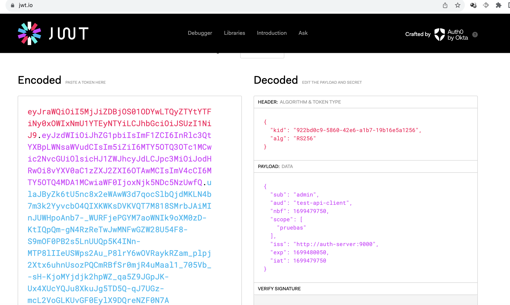
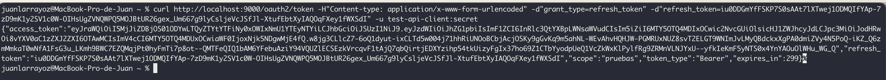

# Proyecto Security Server oauth2

Nombre del proyecto: security-server

  En este proyecto vamos a implementar un servidor de seguridad que utiliza el estándar OAUTH2.

Spring provee el starter **"spring-boot-starter-oauth2-authorization-server"** que provee una implementación de oauth2 para spring.

## Ejecutar el servidor

Para ejecutar el servidor vamos a correr el proyecto desde Eclipse.

Si revisan el archivo **"application.yml** se puede apreciar que se habilitó la ejecución en el puerto 9000

```yml
server:
  port: 9000
```

Una vez hayan levantado el servidor vamos a pegar la siguiente URL en el navegador:

[http://localhost:9000/oauth2/authorize?response_type=code&client_id=test-api-client&redirect_uri=http://localhost:9090/login/oauth2/code/test-api-client&scope=pruebas](http://localhost:9000/oauth2/authorize?response_type=code&client_id=test-api-client&redirect_uri=http://localhost:9090/login/oauth2/code/test-api-client&scope=pruebas)

Al acceder a la URL anterior se les abre por defecto la pantalla de Spring para pedir usuario y contraseña. En este caso las credenciales son:

usuario: admin
password: admin



Una vez que se introduzca correctamente el usuario y pass navegaremos a la siguiente página donde deberemos dar el concentimiento a los scopes (Algo así como roles del usuario) que queremos habilitar:



Para finalizar debemos hacer clic en "Submit Consent".

NOTA: Esta página se abre y se solicita consentimiento del usuario porque así s configuró el server (Clase AuthServerConfig.java):


```java
ClientSettings settings = ClientSettings.builder().requireAuthorizationConsent(true).build();
```

Una vez dado en consentimiento el navegador redireccionará a una página que no existe. En nuestro ejemplo eso es correcto, lo que nos interesa es el código que contiene la URL a la que se redireccionó:



Copiamos el valor del param **code** de la URL. En nuestro ejemplo:

```bash
U9bcsBkcaT26idXGvq-tTOSwPQ5tTAa1k1mE4cResmoACBhGS5Mek6lXUYX_6aZ7XPwcKUbAqIOHoCjgLbA0zPBYTjx8O_MKHj0jUuIZfEJLFG_BuwUiCcRzQiQN2j_g
```

Ese código lo vamos a subsituir por el param $code en la siguiente URL:

```bash
curl http://localhost:9000/oauth2/token -H"Content-type: application/x-www-form-urlencoded" -d"grant_type=authorization_code" -d"redirect_uri=http://localhost:9090/login/oauth2/code/test-api-client" -d"code=$code" -u test-api-client:secret
```

En nuestro ejemplo quedaría asi:

```bash
curl http://localhost:9000/oauth2/token -H"Content-type: application/x-www-form-urlencoded" -d"grant_type=authorization_code" -d"redirect_uri=http://localhost:9090/login/oauth2/code/test-api-client" -d"code=U9bcsBkcaT26idXGvq-tTOSwPQ5tTAa1k1mE4cResmoACBhGS5Mek6lXUYX_6aZ7XPwcKUbAqIOHoCjgLbA0zPBYTjx8O_MKHj0jUuIZfEJLFG_BuwUiCcRzQiQN2j_g" -u test-api-client:secret
```

Al ejecutar el comando curl vamos a canjear ese código por un token válido para acceder a nuestra app:



Del json que retorna el comando curl a priori nos interesa el atributto access_token. Vamos a copiarlo y vamos a ir a la página:

[https://jwt.io](https://jwt.io)

Una vez en la página vamos a pegar el access_token para que ese sea decodificado y poder ver su contenido:



**RECORDAR:** El token tiene un validez de 5 minutos por defecto.

Transcurrido ese tiempo ya no se podrá utlizar para acceder a nuestra API.

Para renovar el token debemos ejecutar el siguiente comando curl:

```bash
curl http://localhost:9000/oauth2/token -H"Content-type: application/x-www-form-urlencoded" -d"grant_type=refresh_token" -d"refresh_token=" -u test-api-client:secret
```

NOTA: debemos substituir  **$token** por el valor del refresh_token obtenido del CURL que nos dio el access_token en primera instancia:

Ejemplo:



Si todo salió correctamente vamos a tener un nuevo access_token y refresh_token.


Hasta aquí lo básico del security server. Ahora vamos a continuar en el proyecto **spring-jwt** donde vamos a asegurar un servicio rest mediante oauth2 y solo se podrá acceder a el con un token válido.


